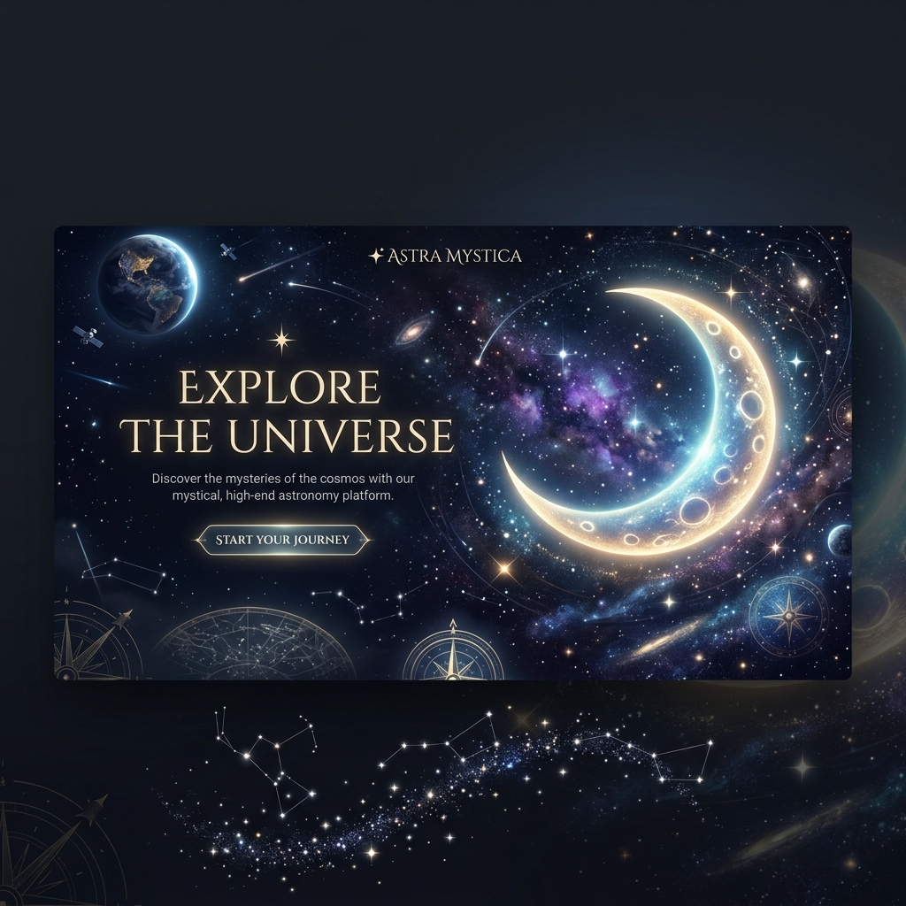

<div align="center">
  

  # 🌌 Cosmic Origin
  
  **The universe remembers the night you arrived.**
  
  [](https://nextjs.org/)
  [](https://reactjs.org/)
  [](https://www.framer.com/motion/)
  
  Cosmic Origin is a stunning, cinematic web application that compiles a beautifully personalized newspaper showcasing the exact astronomical and historical state of the universe on the day you were born.
</div>

---

## ✨ Features

- **🌙 Real-World Astronomy**: Accurately calculates the lunar phase, exact sun/moon constellation positioning, and visibility of the planets (Venus, Mars, Jupiter, Saturn) above the horizon for your exact birthplace.
- **🛰️ NASA Archives**: Retrieves historical images and data from NASA's expansive library corresponding directly to your birth date. Includes specific pulls from Hubble's daily captures.
- **📜 Personalized Newspaper Export**: Compiles your cosmic readings, historical snapshots, and astrological profile into a beautifully styled vintage newspaper that can be exported directly to a high-quality PDF.
- **🌍 Landsat Name Generator**: Dynamically renders your name using genuine satellite imagery mimicking letterforms from the NASA Landsat project.
- **🕰️ Wayback Machine Integration**: Explores the exact snapshot of the internet as it existed on your specific date of arrival.
- **✨ Cinematic Journey**: A multi-stage immersive and animated reveal process powered by Framer Motion.

## 🚀 Quick Start

First, run the development server:

```bash
npm install
npm run dev
```

Open [http://localhost:3000](http://localhost:3000) with your browser to see the experience unfold.

## 🛠️ Technology Stack

- **Framework**: [Next.js](https://nextjs.org) (App Router)
- **Styling**: Custom CSS and modular styles for a premium aesthetic
- **Animation**: [Framer Motion](https://www.framer.com/motion/)
- **Astronomy Engine**: [`astronomy-engine`](https://github.com/cosmowisdom/astronomy-engine) for precision celestial calculations
- **PDF Generation**: `html2canvas` & `jspdf`

## 🔮 How It Works

1. **Input**: Enter your Name, Date of Arrival, exact Time, and Birth Place.
2. **Consulting the Archives**: The application makes asynchronous calls to various APIs:
   - *OpenStreetMap Nominatim* (Geocoding)
   - *Astronomy Engine* (Celestial Positions)
   - *NASA APOD / Images API* (Space Photography)
   - *Wikipedia REST API* (Historical Events)
   - *Internet Archive Wayback Machine* (Digital Snapshots)
3. **The Reveal**: Journey through a cinematic replay sequence leading to your **Cosmic Dashboard** and compile your **Cosmic Archive** newspaper.

---
<div align="center">
  <i>Made with stardust and code.</i>
</div>
